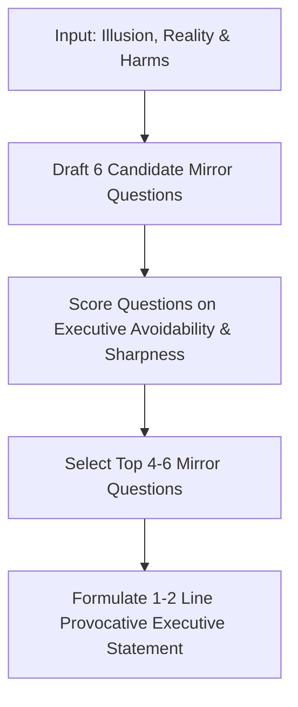

# Workflow: Executive Insight & Mirror Question Generator

A specialized workflow module for transforming raw case-study analysis or digital transformation findings into board-level executive tools: **Mirror Questions** and **Provocative Statements**.

Derived from Protocol v4.8 (Digital Transformation Insights).

---

## 1. Output Deliverables

For any analyzed transformation insight, this workflow produces:
1. **4 to 6 Executive Mirror Questions**: Questions that an executive team (Board, CEO, CxOs, CDIO, CTO, CIO, CISO) can hold up to themselves to identify whether they are trapped in a false assumption or harmful behavior.
2. **1 to 2 Line Provocative Executive Statement**: A credible, memorable, and thought-provoking statement that sticks in the executive's mind and compels action.

---

## 2. Mirror Question Standards

- **Board-Ready Language**: Sharp, plain, direct, and hard to dodge.
- **Expose Hidden Incentives**: Expose real organizational behavior, structural friction, vendor lock-in, or political incentives.
- **No Soft Questions**: Avoid vague "Are we doing our best?" or "How can we improve?" questions. Force binary or diagnostic self-scrutiny.

### Bad vs. Good Mirror Questions

| Weak / Generic Question (Avoid) | Sharp Executive Mirror Question (Required) |
| :--- | :--- |
| *"Are we managing our cloud migration budget effectively?"* | *"Does our cloud budget reflect actual workload optimization, or are we paying premium legacy rates for unoptimized VMs to meet artificial migration deadlines?"* |
| *"Is our vendor alignment strong?"* | *"Have we outsourced risk to a system integrator whose commercial incentives increase when our internal team fails to deliver clear requirements?"* |

---

## 3. Workflow Sequence



### Execution Prompt

```text
Run Executive Insight Generator Workflow on the following insight:
ILLUSION: [Paste Mistaken Belief]
REALITY: [Paste Real Mechanism]
HARMS: [Paste Tangible Organizational Consequences]

Generate:
1. 4 to 6 sharp, board-level Executive Mirror Questions that C-suite leaders cannot dodge.
2. A 1 to 2 line provocative statement that leaves executive leadership thinking and wanting to act.

Enforce em dash ban, non-dramatic sober tone, and strict protocol discipline.
```
