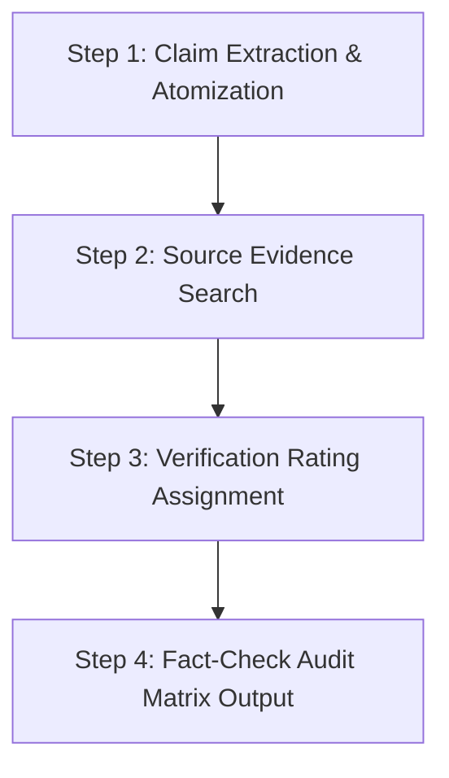

# Workflow: Academic Paper & Report Fact-Checker

A specialized workflow module for verifying claims, empirical findings, methodology validity, and citations in research papers or enterprise reports against source documents.

Based on `collaborative-deep-research/fact-check` and Protocol v4.8 evidence containment standards.

---

## 1. Objectives

- Isolate all factual, empirical, or statistical claims in a target text.
- Verify every claim against uploaded source PDFs or open-access primary literature.
- Flag unevidenced assertions, over-generalizations, or quote distortions.
- Produce a structured **Fact-Check Matrix**.

---

## 2. Fact-Checking Protocol Rules

1. **Claim Atomization**: Break paragraphs down into discrete, testable claims.
2. **Strict Verification Threshold**: A claim is verified ONLY if explicit primary source evidence is provided.
3. **No Motive/Intent Inference**: Do not infer why an author made an unverified claim. Report the discrepancy factually.
4. **Zero Em Dashes**: Maintain standard protocol punctuation rules.

---

## 3. Workflow Steps



### Step 1: Claim Extraction
Extract all claims into a structured list. Assign each claim a unique ID (`C1`, `C2`, etc.).

### Step 2: Source Evidence Search & Mapping
Match each claim against uploaded source PDFs using 6-8 word quote handles.

### Step 3: Verification Rating
Assign one of four strict ratings to each claim:
- `VERIFIED`: Direct verbatim or tight paraphrased match in source PDF.
- `PARTIALLY VERIFIED`: Source supports the core fact but omits specific scope/context.
- `UNVERIFIED / NO EVIDENCE`: No matching source text found.
- `CONTRADICTED`: Source text directly contradicts the statement.

---

## 4. Fact-Check Matrix Template

| Claim ID | Target Statement | Verification Status | Source Reference / Quoted Handle | Discrepancy Analysis |
| :--- | :--- | :--- | :--- | :--- |
| `C1` | *"Project cost grew by 140% in year two."* | `VERIFIED` | *"Budget expanded from £50M to £120M..."* | None. Exact match. |
| `C2` | *"The failure was caused by vendor negligence."* | `CONTRADICTED` | *"Audit report cited internal governance failure..."* | Statement misattributes cause. Source points to internal governance. |
| `C3` | *"85% of enterprises fail digital transformation."* | `UNVERIFIED` | `[NO DIRECT EVIDENCE IN PDF]` | Unsubstantiated general statement. |

---

## 5. Execution Prompt

```text
Run Paper Fact-Checker Workflow on the following input text:
[PASTE TEXT HERE]

Cross-reference against uploaded source PDFs. Output the Discrete Claim List, Evidence Verification Mapping using 6-8 word quoted handles, and the final Fact-Check Audit Matrix. Enforce em dash ban.
```
