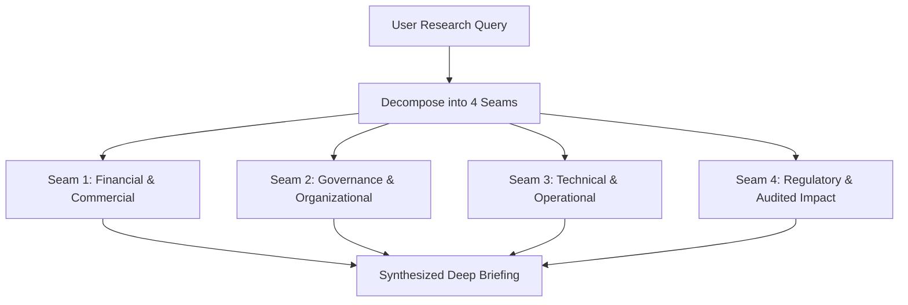

# Workflow: Parallel Deep Research & Query Decomposition

A specialized workflow module for decomposing complex executive research questions into multi-perspective parallel sub-queries, executing structured source search, and synthesizing non-redundant insights.

Based on `parallel-web/parallel-deep-research` and Protocol v4.8 research guidelines.

---

## 1. Core Principles

- **Query Decomposition**: Split broad research topics into 3 to 5 independent, non-overlapping analytical seams (e.g., Governance & Incentives, Financial Impact, Technical Architecture, Regulatory/Legal).
- **Source Archetype Search Pointers**: Formulate targeted search queries, expected outlet types, and story frames for each seam rather than generic keyword searches.
- **Seam Isolation**: Exhaust each analytical seam before proposing conclusions. Do not drift across seams during analysis.
- **Synthesized Convergence**: Combine seam findings into a single executive briefing with strict source handles.

---

## 2. Parallel Research Execution Model



---

## 3. Workflow Steps

### Step 1: Query Decomposition Matrix
Break down the research objective into 3 to 5 orthogonal seams:

```markdown
### Seam 1: Financial & Commercial Performance
- **Sub-Objective**: Identify measurable budget overruns, revenue loss, or contract renegotiations.
- **Source Archetype Pointer**: Financial Times, SEC 10-K, audited earnings reports.
- **Search Keywords**: `"[Company]" "write-down" OR "contract dispute" "transformation"`

### Seam 2: Governance & Executive Incentives
- **Sub-Objective**: Analyze board oversight, reporting lines, and incentive misalignments.
- **Source Archetype Pointer**: Public audit reports, parliamentary/court inquiries, investigative journalism.
- **Search Keywords**: `"[Company]" "internal audit" OR "governance failure" "project"`
```

### Step 2: Evidence Gathering & Verification
For each seam, gather verified open-access sources or PDFs. Ensure zero reliance on unverified blog posts or vendor PR.

### Step 3: Seam-by-Seam Synthesis
Produce bulleted evidence extractions for each seam with quoted handles (first 6-8 words).

### Step 4: Executive Master Synthesis
Combine findings into an executive summary adhering to the non-negotiable protocol rules (sober tone, no fluff, zero em dashes, strict evidence containment).
